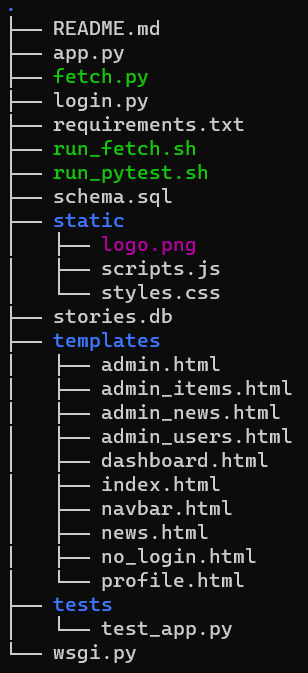

# Full-Stack Web Application by Jose Brouwer


## Features
- User authentication via Auth0.
- Admin dashboard for managing news items and user interactions.
- Ability to like or dislike news stories.
- Pagination for news stories.
- User profile management.

## Tech Stack
- **Frontend**: HTML, CSS, Bootstrap v5.3
- **Backend**: Python (Flask)
- **Database**: SQLite3
- **Testing**: pytest, coverage
- **Version Control**: Git

## Directory Structure


## Installation
1. **Clone Repository**
    ```
    git clone https://gitlab.com/jose-brouwer-website/josebrouwer.me.git
    cd josebrouwer.me
    ```
2. **Set Up Virtual Environment (optional)**
    ```
    python3 -m venv venv
    source venv/bin/activate
    ```
3. **Install Dependencies**
    ```
    pip install -r requirements.txt
    ```
4. **Database**
    - A provisional database "stories.db" is included but you can create a fresh database following these steps
    ```
    sqlite3 stories.db < schema.sql
    ```
## Running the Application
1. **Fetch the Latest News**
    - This will create a log file "fetch_log.txt" with the times the database has been updated
    ```
    ./run_fetch.sh
    ```
2. **Run the Flask App**
    ```
    python3 app.py
    ```
3. **Access the App**
    - Open web browser and go to
    ```
    http://localhost
    ```
    - Or go to: 
    ```
    http://127.0.0.1
    ```

## Testing
1. **Make sure `run_pytest.sh` script is executeable**
    ```
    sudo chmod +x run_pytest.sh
    ```
2. **Run shell script from repository root**
    - The script sets the working directory to be the repository root. 
    - ***Make sure to replace <path/to/project> with your path***
    ```
    #!/bin/bash
    export PYTHONPATH=<path/to/project>:$PYTHONPATH
    coverage run -m pytest "$@"
    coverage report
    ```
    - Once you set your own path run the script as follows:
    ```
    ../josebrouwer.me$ ./run_pytest.sh
    ```
    - The script runs the unit tests and provides a coverage report

## Libraries Used
- **Flask:** A micro web framework written in Python.
- **Authlib:** Authentication library for Flask.
- **pytest:** A framework for writing small tests in Python.
- **coverage:** A tool for measuring code coverage of Python programs.

## Notes
- The `run_pytest.sh` script sets the `PYTHONPATH` environment variable for the duration of the script's execution to ensure that pytest can find all necessary modules.
- The `run_fetch.sh` script is used to fetch the latest news stories and should be set to run periodically (e.g., via a cron job).

## Mozilla Security Report
